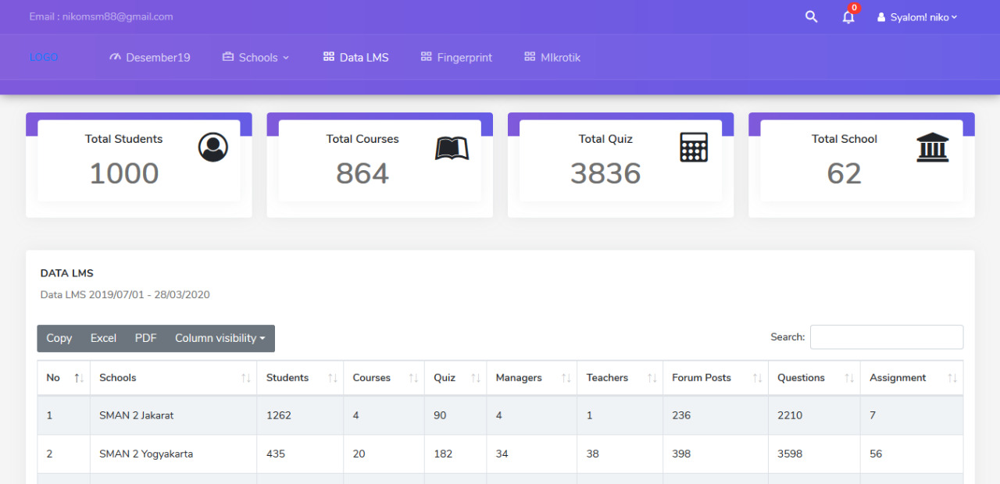

# moodle-hits
python sederhana untuk mengetahui aktivitas pengunjung seperti active user,page view,unique ip multisite moodle
tabel app1_moodleconfig = menyimpan credential db moodle,
tabel a_hits = menyimpan hasil hits

django version coming soon.
[]
